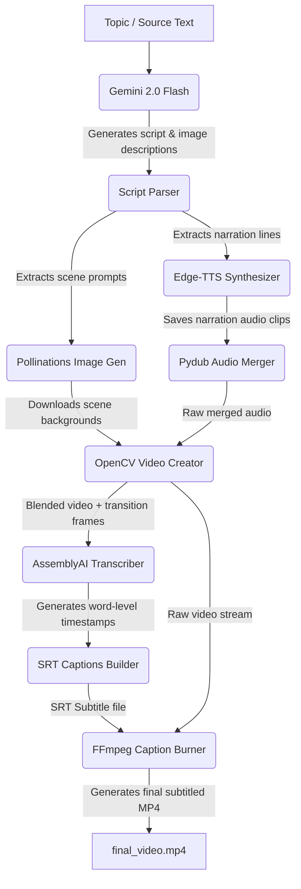

# ShortVideos 🎬

ShortVideos is an automated, AI-driven command-line tool for generating high-quality vertical short-form videos ("shorts" or "reels") with a ChatGPT/Gemini generated script, narrated by Edge-TTS text-to-speech. Background images are generated using the Pollinations AI Flux engine, and precise word-level subtitles are hardburned via FFmpeg using AssemblyAI word timestamps.

---

## 🚀 Core Features

- **Advanced Scriptwriting**: Leverages **Gemini 2.0 Flash** to draft highly engaging, timed short-form narrative scripts.
- **Keyless Neural Voiceover**: Integrates **Edge-TTS** to generate natural neural narration, removing dependencies on paid text-to-speech API keys.
- **Flux Background Imagery**: Utilizes the high-fidelity **Flux** model via the Pollinations API to generate vivid vertical background assets.
- **Precise Word-Level Captioning**: Leverages the **AssemblyAI API** for quick, precise word-level audio timestamps.
- **FFmpeg Subtitle Hardburning**: Pre-configures static **FFmpeg** & **FFprobe** binaries inside the local virtual environment, dynamically injecting them into the system path for seamless caption hardburning.
- **Offline / Resilient Fallback Mode**: Skip external API script generation using cached fallback scripts if API keys are rate-limited or exhausted.

---

## 🛠️ System Architecture

The pipeline orchestrates text generation, speech synthesis, image generation, audio-video editing, and subtitle rendering in a linear workflow:



### Flow Breakdown:
1. **Script Drafting**: The input prompt is sent to Gemini 2.0 to draft scene-by-scene script narrations coupled with image descriptions.
2. **Narration Synthesis**: Edge-TTS generates neural voice lines (`.mp3`) for each scene.
3. **Asset Generation**: Pollinations.ai creates portrait-oriented images based on script scene descriptions.
4. **Video Compilation**: OpenCV processes, crops, and resizes background images to standard vertical mobile layout (576x1024), adding cross-fade transitions.
5. **Timeline Alignment**: AssemblyAI transcribes the combined narration audio to obtain word-level timestamp intervals.
6. **Subtitling**: FFmpeg compiles the SRT captions and burns them into the video frames to generate the final distribution-ready short.

---

## 📥 Installation

Ensure you have **Python 3.10+** installed.

### 1. Clone & Set Up Virtual Environment
```bash
# Set up a python virtual environment
python -m venv .venv
source .venv/bin/activate
```

### 2. Install Project Dependencies
```bash
pip install -r requirements.txt
```

### 3. Provision FFmpeg and FFprobe Binaries
ShortVideos automatically detects if static FFmpeg/FFprobe binaries are installed inside the virtualenv's `.venv/bin` directory, pre-pending them to the execution path at runtime.

To install static binaries locally:
- **Linux/macOS**:
  You can run the helper script to auto-fetch static builds into `.venv/bin`:
  ```bash
  chmod +x .venv/bin/edge-tts  # ensures virtualenv binaries work
  # Fetch static builds
  wget -O .venv/bin/ffmpeg https://johnvansickle.com/ffmpeg/builds/ffmpeg-git-amd64-static.tar.xz
  # (Extract and place the 'ffmpeg' and 'ffprobe' binaries directly into .venv/bin/)
  ```

---

## ⚙️ Configuration

Configure your environment variables by creating a `.env` file in the root directory:

```env
GEMINI_API_KEY=your_gemini_api_key_here
ASSEMBLYAI_API_KEY=your_assemblyai_api_key_here
```

*Note: Default fallback keys are built-in for testing purposes, but setting your own variables avoids rate limits.*

---

## 🎮 How to Operate

Run ShortVideos using the main CLI entry point:

```bash
# Activate your environment
source .venv/bin/activate

# Run using the default built-in story topic
python main.py

# Run with a custom topic prompt
python main.py --topic "A short scary story about a time-traveling grandfather paradox"

# Run with a source file containing story text
python main.py --source source.txt

# Run in OFFLINE mode (skips Gemini scriptwriting & uses cached script response to save API quota)
python main.py --offline
```

### CLI Command Options:
```
options:
  -h, --help            show this help message and exit
  -t TOPIC, --topic TOPIC
                        The topic or story description to generate a video for. (default: None)
  -s SOURCE, --source SOURCE
                        Path to a text file containing the source story or riddles. (default: None)
  -o OUTPUT, --output OUTPUT
                        Output filename for the compiled video. (default: final_video.mp4)
  -offline, --offline   Run in offline mode using the cached fallback script. (default: False)
```

---

## 📁 Output Structure

Every run creates a timestamp-named directory inside `shorts/` containing:
- `response.txt`: The raw Gemini script output.
- `title.txt`: The video title parsed from the script.
- `description.txt`: The complete description text.
- `images/`: Downloaded Flux background scene images.
- `narrations/`: Synthesized scene-by-scene audio voiceovers.
- `captions.srt`: The generated subtitle tracks.
- `final_video.mp4`: The final, high-fidelity captioned short video.
